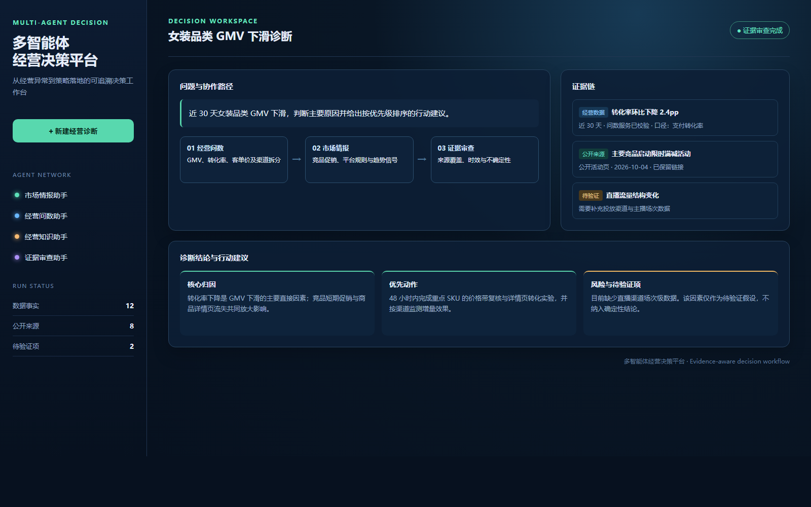

# 多智能体经营决策平台

这是一个面向品牌/平台招商运营团队的多智能体经营决策平台。它将**经独立问数服务校验的经营事实**、公开市场情报、内部经营资料和用户附件汇聚为一份可追溯的增长诊断与行动建议。

它刻意不重复实现 Text-to-SQL：已有的「电商智能问数 Agent」专注自然语言到安全 SQL、Schema 混合检索与只读执行；本平台通过受控 HTTP 合约消费它的结果，负责跨源取证、归因、证据审查和报告交付。

## 产品闭环

```text
经营问题
  ├─ 市场情报助手：竞品 / 平台规则 / 舆情 / 行业趋势
  ├─ 经营问数助手：调用独立问数服务，取得已校验的业务事实
  ├─ 经营知识助手：SOP / 活动复盘 / 品类策略 / 上传附件
  └─ 证据审查助手：完整度、时效、来源覆盖与待验证项
                         ↓
             诊断归因、策略建议、Markdown / PDF 报告
```

## 界面预览



> 预览图为静态产品原型，用于展示核心交互与信息架构；运行中的界面会实时展示子智能体调用、证据事件和报告产物。

## 与「电商智能问数 Agent」的边界

| 能力 | 电商智能问数 Agent | 多智能体经营决策平台 |
| --- | --- | --- |
| 目标 | 回答“指标是多少、按什么维度变化” | 回答“为什么发生、应做什么、证据是否充分” |
| 数据访问 | Schema 检索、SQL 生成/校验、只读执行 | 仅调用问数服务，不连接业务库、不生成 SQL |
| 核心技术 | LangGraph、Qdrant、Elasticsearch、MySQL | DeepAgents 多智能体、FastAPI、WebSocket、Tavily、RAGFlow、证据规则引擎 |
| 产物 | 可审计的数据答案 | 跨源证据链、增长诊断、行动清单、Markdown/PDF 报告 |

## 多智能体设计

- **市场情报助手**：采集竞品动作、平台规则、行业趋势和公开用户反馈，保留 URL 与发布时间。
- **经营问数助手**：调用已部署的问数服务，要求返回指标口径、时间范围、执行状态与 SQL 审计摘要；服务边界确保本项目没有直接 SQL 执行能力。
- **经营知识助手**：从企业内部策略、活动复盘、商品资料等材料获取组织上下文。
- **证据审查助手**：在出结论前用确定性规则检查来源类型、URL、时间范围和缺失证据，避免“有结论无依据”。
- **编排主智能体**：负责假设拆解、选择性路由、归因和报告生成；不把不充分的证据表述为事实。

## 问数服务契约

配置 `ECOM_ANALYTICS_API_URL` 后，本平台会调用：

```text
POST {ECOM_ANALYTICS_API_URL}/api/analytics/query
```

请求体：

```json
{"question": "近 30 天女装品类 GMV 与转化率变化", "context": "可选的已知条件", "caller": "commerce_compass"}
```

响应至少需要包含 `data` 与 `execution_status`；建议同时返回 `metric_definition`、`time_range`、`sql_audit` 与 `limitations`。本平台只消费结果，绝不透传任意 SQL。

## 本地启动

1. 安装后端：`uv sync`
2. 复制 `.env.example` 为 `.env`，配置模型、Tavily、RAGFlow 和问数服务地址。
3. 启动 API：`uv run uvicorn app.api.server:app --host 0.0.0.0 --port 8000 --reload`
4. 启动前端：`cd frontend && pnpm install && pnpm dev`

可尝试：

```text
分析近 30 天女装品类 GMV 下滑的可能原因：先查询经营数据，再检索主要竞品促销与平台规则变化；给出证据链、优先级排序的行动建议和待验证项，并生成 Markdown 报告。
```

## 后续演进

1. 用 PostgreSQL 持久化任务、证据、报告版本和人工复核记录。
2. 用 Redis 队列承载长任务、重试与并发限制。
3. 增加指标异常检测、策略实验记录与报告评测集。
4. 增加角色权限、组织隔离、文件安全扫描和审计日志。

## Acknowledgements

本项目的早期多智能体研究原型参考了 [didilili/deepsearch-agents](https://github.com/didilili/deepsearch-agents)。本项目已围绕电商增长情报场景，独立重构了产品定位、智能体协作边界、问数服务适配、证据审查机制与交互文案。

> 原仓库未明确展示许可证；公开发布本项目之前，请确认原作者授权范围，或将保留的原始实现进一步替换为独立实现。
